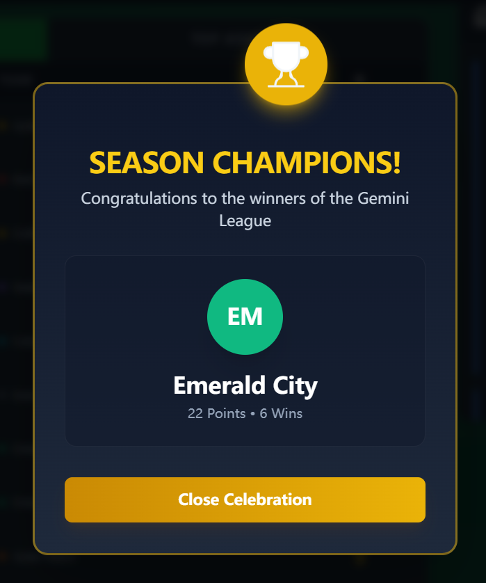

# Gemini Football Manager

**Gemini Football Manager** is a **hybrid sports simulation platform** that merges algorithmic game logic with Generative AI (Google Gemini 2.5 Flash). Unlike traditional text-based simulators that rely on pre-written templates, this application generates unique, context-aware narratives for every match, news report, and season outcome, creating a "living" football world.

It is a React-based single-page application (SPA) designed to simulate a complete 14-round league season for 8 fictional teams, tracking detailed statistics for both clubs and individual players.

---

## 🌊 The "Momentum" (User Experience Flow)

The application is designed to build narrative tension and engagement through three distinct phases:

### 1. The Build-Up (Rounds 1-6)
*   Users begin simulating matches. The "Momentum" starts with establishing team hierarchies. The AI generates initial match commentaries, establishing which teams are strong (e.g., *Red Star Nova*) and which are struggling.
*   **Visual Feedback:** The "Live Standings" table updates dynamically, and the News Feed begins populating with round recaps.

### 2. The Mid-Season Pivot (Round 7)
*   **Milestone Event:** Upon completing Round 7, the application triggers a "Winter Champion" event. A specific banner appears highlighting the league leader.
*   This disrupts the flow, giving the user a pause to reflect on the standings and see if the leader can hold their position for the second half of the season.

### 3. The Climax (Rounds 8-14)
*   The "Momentum" accelerates as the round counter approaches the limit.
*   **Grand Finale:** At the end of Round 14, the simulation engine locks. A **Champion Celebration Modal** takes over the screen, utilizing particle effects (fireworks/confetti) and dynamic UI to crown the winner.
*   **Final State:** The app transitions to a "Season Completed" state, allowing the user to review the final Table, the Golden Boot (Top Scorer) race, and the Assist Leaders in retrospect.

---

## 🚀 Core Pillars & Features

### The Hybrid Simulation Engine
*   **Algorithmic Layer:** Uses weighted probabilities based on Team Stats (Attack/Defense/Midfield) to calculate scores, realistic goal distribution, and player stat attribution (Goals/Assists).
*   **Generative Layer (Gemini API):** Wraps the math in a story. It analyzes the raw data (e.g., *Home 3 - 0 Away*) to write journalistic match reports, pundits' commentary, and "Breaking News" headlines that adapt to the context of the score.

### Deep Statistical Tracking
The app goes beyond simple W-D-L records. It creates a persistent state for every player in the league:
*   **Roster Generation:** Procedurally generates names and positions for 8 teams.
*   **Individual Accolades:** Tracks the "Golden Boot" (Goals) and "Playmaker Award" (Assists) in real-time.
*   **Table Logic:** Implements standard football tie-breaking rules (Points > Goal Difference > Goals Scored).

### Immersive UI/UX
*   **Aesthetic:** Styled with a "Pitch Green" theme, utilizing glassmorphism (translucent backdrops) to give it a modern, premium sports app feel.
*   **Interactivity:** Users can request specific AI analysis for individual matches or simulate entire rounds at once.
*   **Feedback:** Visual cues (Spinners, disabling buttons during simulation) ensure the user always knows the app's state.

---

## 🛠 Technical Summary
*   **Framework:** React 19 (TypeScript)
*   **Styling:** Tailwind CSS (Custom "Pitch" color palette, Animations)
*   **AI Integration:** Google GenAI SDK (`gemini-2.5-flash` model)
*   **State Management:** Complex React Hooks (`useState`, `useEffect`, `useCallback`) handling immutable state updates for nested objects (Teams -> Players -> Stats).

---

# Run and deploy your AI Studio app

This contains everything you need to run your app locally.

View your app in AI Studio: https://ai.studio/apps/drive/1e0zADtEi8wTjsfYnv3h76uiyK5vbi13S

## Run Locally

**Prerequisites:**  Node.js

1. Install dependencies:
   `npm install`
2. Set the `GEMINI_API_KEY` in [.env.local](.env.local) to your Gemini API key
3. Run the app:
   `npm run dev`
